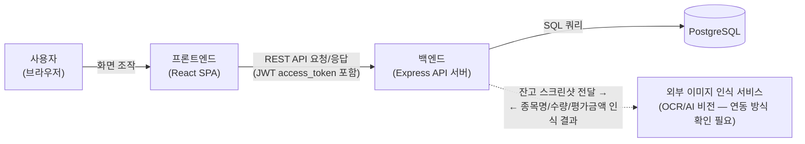
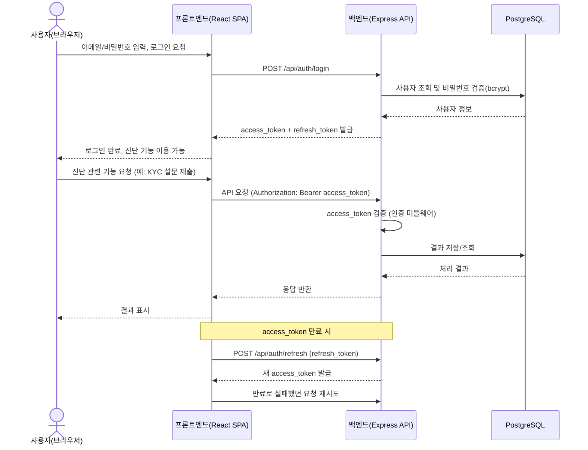

# 아키텍처 다이어그램 — my-pb

## 버전 이력

| 버전 | 일자 | 변경 내용 |
|---|---|---|
| v1.0 | 2026-09-13 | docs 문서 기반 아키텍처 다이어그램 최초 작성 |

작성일: 2026-09-13
근거 문서: `docs/1-domain-definition.md`(v1.2), `docs/2-PRD.md`(v1.1), `docs/3-user-scenario.md`(v1.0), `docs/4-wireframe.md`(v1.0), `docs/5-project-principle.md`(v1.1)

> 본 문서는 **2일·1인 개발 MVP** 규모에 맞춰 시스템을 구성하는 컴포넌트 수준까지만 표현한다. 화면별 상세 흐름, DB 테이블 ERD, 로드밸런서·오토스케일링·캐시 레이어 등 확정되지 않은 인프라는 그리지 않는다.

---

## 1. 전체 시스템 구성도

프론트엔드(React SPA), 백엔드(Express API 서버), 데이터베이스(PostgreSQL), 외부 이미지 인식 서비스(OCR/AI 비전) 간의 관계를 표현한다.

- 점선 화살표(백엔드 ↔ 외부 이미지 인식 서비스)는 도메인 정의서 8절·PRD 9절에서 아직 "확인 필요"로 남아 있는 연동이라는 점을 표시하기 위한 것이다. 실제 구현 수단(라이브러리/API)은 미정이다.
- 백엔드는 무상태(stateless) API 서버 한 대로 표현했다 (PRD 5절 비기능 요구사항). 로드밸런서·오토스케일링 등 확장 인프라는 PRD 8절 기준 이번 MVP 범위가 아니므로 그리지 않았다.
- PostgreSQL은 단일 인스턴스로 표현했다. 복제/캐시 레이어는 그리지 않았다.

---

## 2. 인증 및 API 요청 흐름 (시퀀스 다이어그램)

로그인 시 JWT(access_token/refresh_token) 발급, 인증이 필요한 API 요청 시 access_token 검증, access_token 만료 시 refresh_token을 이용한 재발급(사용자 시나리오 7)을 개념 수준으로 표현한다.

- refresh_token 저장 방식(httpOnly 쿠키 vs 클라이언트 저장소)과 재발급 실패(refresh_token 만료) 시 구체적 처리 방식은 PRD 9절 확인 필요 사항이므로, 이 다이어그램에서는 "재발급" 개념만 표시하고 세부 분기는 그리지 않았다.

---

## 단순화를 위해 생략한 것

- 화면별(회원가입/로그인/대시보드/설문/업로드/보정/결과) 상세 데이터 흐름 — 4-wireframe.md의 화면 흐름도로 대체
- DB 테이블 ERD, 컬럼 수준 설계 — 5-project-principle.md 3절 네이밍 매핑표로 대체
- 프론트엔드 FSD 레이어(app/pages/features/entities/shared) 내부 구조 — 5-project-principle.md 6절 디렉토리 트리로 대체
- 로드밸런서, 오토스케일링, 캐시 레이어, CDN 등 확정되지 않은 인프라 (PRD 8절 "1000명 동시접속 목표"는 비즈니스 목표로만 유지되고 이번 MVP에서 실제 구축하지 않음)
- refresh_token 재발급 실패 시의 상세 분기, 외부 이미지 인식 서비스의 구체적 API 스펙 (모두 "확인 필요" 상태)
