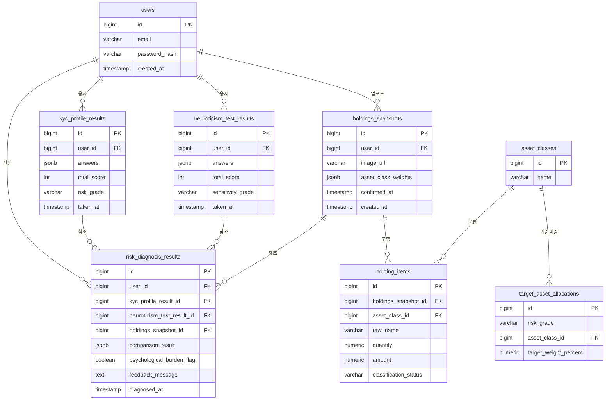

# ERD — my-pb

## 버전 이력

| 버전 | 일자 | 변경 내용 |
|---|---|---|
| v1.0 | 2026-09-13 | docs 문서 기반 ERD 최초 작성 |

작성일: 2026-09-13
근거 문서: `docs/1-domain-definition.md`(v1.2) 3절·4절, `docs/2-PRD.md`(v1.1) FR-0, `docs/5-project-principle.md`(v1.1) 3절 네이밍 매핑표

> 본 문서는 **2일·1인 개발 MVP** 규모에 맞는 최소한의 스키마를 제안한다. 도메인 정의서 3절의 7개 엔티티를 기준으로 하며, 문서에 근거 없는 테이블/컬럼은 추가하지 않는다. 컬럼 타입은 이해에 필요한 수준으로만 표기하고, 길이 제약·인덱스 전략 등은 다루지 않는다.

---

## 1. ERD

---

## 2. 테이블 설명

| 테이블 | 대응 도메인 개념 | 근거 |
|---|---|---|
| `users` | 사용자(User) | 도메인 정의서 3절. `email`/`password_hash`는 도메인 정의서에는 없으나 PRD FR-0.1/FR-0.2(이메일+비밀번호 회원가입/로그인)에 근거해 추가했다. |
| `kyc_profile_results` | 투자자성향 진단결과(KycProfileResult) | 도메인 정의서 3절. `answers`는 10개 문항 응답, `risk_grade`는 5단계 등급(도메인 정의서 6절 구간 기준)을 저장한다. |
| `neuroticism_test_results` | IPIP 신경성 검사결과(NeuroticismTestResult) | 도메인 정의서 3절. `sensitivity_grade`는 심리민감도 등급(높음/보통)을 저장한다. |
| `holdings_snapshots` | 보유잔고 스냅샷(HoldingsSnapshot) | 도메인 정의서 3절. `image_url`은 원본 스크린샷 이미지 참조, `asset_class_weights`는 자산군별 집계 비중(확정 시점에 계산되어 저장)이다. |
| `holding_items` | 자산 항목(HoldingItem) | 도메인 정의서 3절. `classification_status`는 도메인 정의서 3절에 정의된 "자동 분류 확정 / 사용자 보정 필요 / 사용자 보정 완료" 세 값을 갖는다. |
| `asset_classes` | 자산군(AssetClass) | 도메인 정의서 3절. 주식/채권/펀드/현금성자산 등 자산군 마스터 데이터. |
| `target_asset_allocations` | 성향기준 비중 (도메인 정의서 2절 용어) | 도메인 정의서 3절 AssetClass의 "성향 등급별 기준 비중과의 매핑 근거" 속성을 별도 매핑 테이블로 정규화한 것. 성향 등급(`risk_grade`)과 자산군(`asset_class_id`) 조합별 기준 비중을 저장한다. 구체적인 비중 값은 도메인 정의서 8절 기준 미정이므로 이 문서에서 다루지 않는다. |
| `risk_diagnosis_results` | 리스크 진단 결과(RiskDiagnosisResult) | 도메인 정의서 3절·4절. 투자자성향 진단결과·IPIP 신경성 검사결과·보유잔고 스냅샷을 각 1건씩 참조(4절 "3자 대조 결과물")하며, `comparison_result`에 자산군별 정합/괴리 판정을 저장한다. |

관계는 도메인 정의서 4절을 그대로 반영했다: 사용자 1:N 각 진단결과, 보유잔고 스냅샷 1:N 자산 항목, 자산 항목 N:1 자산군, 리스크 진단 결과는 세 결과를 각 1건씩 참조.

---

## 3. 확인이 필요한 사항

이 ERD를 작성하며 문서에 명시적 근거가 없어 임의로 판단한 설계 지점이다. 실제 구현 전 확인이 필요하다.

- **문항별 응답 저장 방식**: `kyc_profile_results.answers`, `neuroticism_test_results.answers`를 문항별 응답 1행씩 저장하는 별도 정규화 테이블 대신 **JSONB 컬럼 하나**로 저장하는 방식을 기본으로 제안했다. 도메인 정의서에 문항 단위로 개별 조회·통계를 내야 한다는 요구사항이 없어 2일 MVP 규모에서는 단순한 방식이 적절하다고 판단했으나, 이는 임의 판단이다. 문항별 분석이 필요해지면 정규화 테이블로 전환이 필요하다.
- **자산군(AssetClass) 정규화 수준**: 자산군을 `asset_classes` 마스터 테이블 + `target_asset_allocations` 매핑 테이블로 정규화하는 방식을 제안했다. 대안으로 자산군을 DB 테이블 없이 코드 레벨 상수(enum)로 처리하는 방법도 가능하며, 문서에는 어느 쪽이 맞는지 명시되어 있지 않다. 이번 제안은 "성향기준 비중"이 도메인 정의서 2절에 정의된 명시적 개념이고, `holding_items`가 자산군을 FK로 참조하려면 마스터 테이블이 있는 편이 일관적이라고 판단해 정규화 쪽을 선택한 것이다.
- **HoldingItem의 자산군 분류 컬럼**: 위 판단과 연결해 `holding_items.asset_class_id`를 `asset_classes`에 대한 FK로 설계했다. 문자열/enum 컬럼으로 단순화하는 대안도 가능하다.
- **`target_asset_allocations`의 실제 비중 값**: 테이블 구조만 제안했으며, 5단계 성향 등급별 자산군 기준 비중의 실제 수치는 도메인 정의서 8절 "성향기준 비중표" 확인 필요 항목과 동일하게 미정이다.
- **리스크 진단 결과의 자산군별 판정 저장 방식**: `risk_diagnosis_results.comparison_result`도 문항별 응답과 동일한 논리로 JSONB 컬럼에 자산군별 정합/괴리 판정 배열을 저장하는 방식을 제안했다. 별도 정규화 테이블(진단결과 1건 - 자산군별 판정 N행)로 분리하는 대안도 가능하다.
- **정합성/괴리 판정 임계값**: `comparison_result`에 저장될 판정 로직 자체(몇 %p 이상 차이일 때 '괴리'로 볼지)는 도메인 정의서 8절 기준 미정이며, 이 ERD는 저장 구조만 제안하고 값은 다루지 않는다.
- **원본 스크린샷 이미지 저장 위치**: `holdings_snapshots.image_url`은 이미지가 어딘가에 저장되고 그 경로/URL만 DB에 남는다고 가정한 것이다. 실제 저장 위치(로컬 디스크/클라우드 스토리지 등)와 원본 이미지 보관·파기 정책은 도메인 정의서 8절, `docs/5-project-principle.md` 확인 필요 사항과 동일하게 미정이다.
