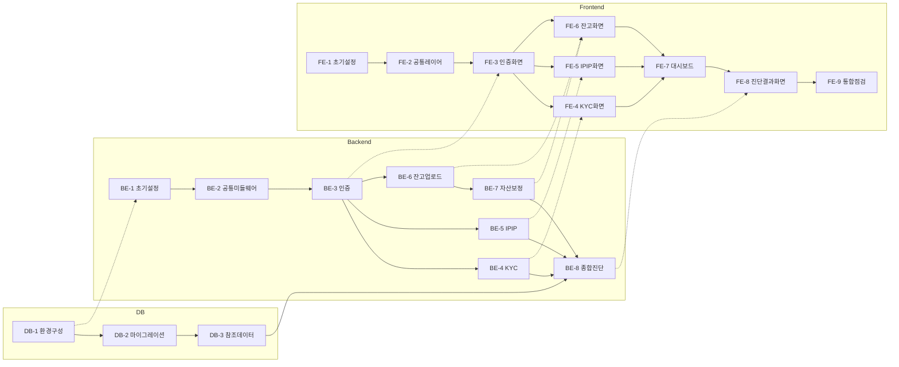

# 작업 실행 계획(WBS) — my-pb

## 버전 이력

| 버전 | 일자 | 변경 내용 |
|---|---|---|
| v1.0 | 2026-09-13 | docs 문서 기반 실행 계획 최초 작성 |

작성일: 2026-09-13
근거 문서: `docs/1-domain-definition.md`(v1.2), `docs/2-PRD.md`(v1.1), `docs/3-user-scenario.md`(v1.0), `docs/4-wireframe.md`(v1.0), `docs/5-project-principle.md`(v1.1), `docs/6-arch.md`(v1.0), `docs/7-erd.md`(v1.0), `docs/schema.sql`

> 본 문서는 **2일·1인 개발 MVP** 규모에 맞춰 작업을 데이터베이스/백엔드/프론트엔드 단위로 분할한 실행 계획이다. 각 Task는 독립적으로 착수·완료 판단이 가능하도록 수행 작업·완료 조건(체크박스)·선행 Task를 명시한다. PRD 7절의 Day1/Day2 마일스톤보다 더 세분화된 실행 단위이며, 우선순위는 8절의 의존관계를 따른다.

---

## 0. 진행 전 확인 필요한 선결 사항 (블로커)

아래 항목은 도메인 정의서·PRD·프로젝트 구조 원칙 문서에 이미 "확인 필요"로 명시된 사항 중, 특정 Task의 완료를 실질적으로 막는 것들이다. 해당 Task 설명에도 각각 표시해두었다. 2일 일정상 확인이 늦어지면 아래 순서로 가장 단순한 값을 정해 임시 확정하고 진행하는 것을 권장한다(사후 조정 가능하도록 값만 교체하면 되는 지점에 캡슐화되어 있음 — `5-project-principle.md` 5절 참조).

- **성향기준 비중표** (도메인 정의서 8절) — DB-3, BE-8을 막음
- **정합성/괴리 판정 임계값** (도메인 정의서 8절) — BE-8을 막음
- **OCR/AI 비전 구현 수단** (도메인 정의서 8절, PRD 9절) — BE-6을 막음
- **종목명→자산군 자동 분류 기준 데이터** (도메인 정의서 8절) — BE-7을 막음
- **프론트엔드 라우팅 라이브러리 선정** (5-project-principle.md 확인 필요) — FE-1을 막음
- **업로드 이미지 저장 위치/보관 정책** (도메인 정의서 8절) — BE-6을 막음

---

## 1. 데이터베이스(DB) Task

### DB-1. PostgreSQL 17 환경 구성

**선행 Task**: 없음

**수행 작업**
- PostgreSQL 17 인스턴스 준비(로컬 설치 또는 컨테이너)
- `my_pb` 데이터베이스 생성
- 접속 계정/비밀번호 확인 및 `DATABASE_URL` 형식 접속 문자열 작성

**완료 조건**
- [ ] PostgreSQL 17 인스턴스에 정상 접속 가능
- [ ] `my_pb` 데이터베이스가 생성되어 있음
- [ ] `DATABASE_URL` 접속 문자열을 확보함

---

### DB-2. 스키마 마이그레이션 적용

**선행 Task**: DB-1

**수행 작업**
- `docs/schema.sql`을 `backend/src/db/migrations/`에 배치
- 해당 SQL을 `my_pb` 데이터베이스에 실행하여 8개 테이블 생성
- 생성된 테이블·FK 제약조건·인덱스가 `docs/7-erd.md`와 일치하는지 확인

**완료 조건**
- [ ] `schema.sql`이 `backend/src/db/migrations/`에 위치함
- [ ] `users`, `asset_classes`, `kyc_profile_results`, `neuroticism_test_results`, `holdings_snapshots`, `holding_items`, `target_asset_allocations`, `risk_diagnosis_results` 8개 테이블이 모두 생성됨
- [ ] FK 제약조건과 인덱스가 정상 생성됨을 확인함 (`\d` 등으로 확인)

---

### DB-3. 초기 참조 데이터 입력 (자산군 · 성향기준 비중)

**선행 Task**: DB-2

**수행 작업**
- `asset_classes`에 자산군 마스터 데이터(주식/채권/펀드/현금성자산 등) 입력
- `target_asset_allocations`에 5단계 투자자성향 등급 × 자산군별 기준 비중 데이터 입력

**완료 조건**
- [ ] ⚠️ **선결 필요**: 5단계 성향 등급별 자산군 기준 비중표가 확정됨 (도메인 정의서 8절 — 미확정 시 도메인 정의서 예시 1건만으로 전체 표를 임시 구성해 진행)
- [ ] 자산군 목록이 확정되어 `asset_classes`에 입력 완료됨
- [ ] 확정된 비중표 전체 조합이 `target_asset_allocations`에 입력 완료됨

---

## 2. 백엔드(Backend) Task

### BE-1. 백엔드 프로젝트 초기 설정

**선행 Task**: DB-1

**수행 작업**
- `backend/`에 Node.js 프로젝트 초기화(`package.json`)
- Express, `pg`, `bcrypt`, `jsonwebtoken`, `dotenv`, `cors`, `morgan`, 업로드 처리 라이브러리(예: `multer`) 설치
- `5-project-principle.md` 6절 기준 디렉토리 생성: `routes/`, `services/`, `middleware/`, `utils/`, `db/`, `config/`
- `db/pool.js`(pg Pool), `config/env.js`(환경변수 로드), `app.js`/`server.js` 뼈대 작성
- `.env.example` 작성 (`DATABASE_URL`, `JWT_ACCESS_SECRET`, `JWT_REFRESH_SECRET`, `JWT_ACCESS_EXPIRES_IN`, `JWT_REFRESH_EXPIRES_IN`, `CORS_ORIGIN`, `PORT` 포함)

**완료 조건**
- [ ] `npm install`로 필요한 패키지 설치 완료
- [ ] `5-project-principle.md` 6절 구조대로 디렉토리가 생성됨
- [ ] `server.js` 실행 시 지정한 `PORT`로 서버가 정상 기동됨
- [ ] `db/pool.js`를 통해 DB-1의 PostgreSQL에 커넥션 성공 확인
- [ ] `.env.example`에 필요한 환경변수 키가 모두 나열됨

---

### BE-2. 공통 미들웨어 구현 (인증 · 에러 · CORS · 로깅)

**선행 Task**: BE-1

**수행 작업**
- `middleware/auth.middleware.js`: JWT access_token 검증
- `middleware/error.middleware.js`: 공통 에러 응답 포맷 처리
- CORS 화이트리스트 설정(`CORS_ORIGIN` 기반)
- `morgan` 요청 로깅 적용

**완료 조건**
- [ ] access_token 없이 보호된 라우트 요청 시 401 응답 확인
- [ ] 유효한 access_token으로 요청 시 정상 통과 확인
- [ ] 처리되지 않은 에러 발생 시 공통 에러 응답 포맷으로 반환됨을 확인
- [ ] 허용되지 않은 origin의 요청이 CORS로 차단됨을 확인

---

### BE-3. 인증 도메인 구현 — 회원가입/로그인/토큰 재발급 (FR-0)

**선행 Task**: DB-2, BE-2

**수행 작업**
- `routes/auth.routes.js`, `services/auth.service.js` 작성
- 회원가입: 이메일 중복 확인, `bcrypt` 해시 후 `users`에 저장
- 로그인: 비밀번호 검증, JWT `access_token`/`refresh_token` 발급
- 토큰 재발급: `refresh_token` 검증 후 새 `access_token` 발급

**완료 조건**
- [ ] `POST /api/auth/signup` — 이메일/비밀번호로 회원가입 성공 (FR-0.1)
- [ ] 중복 이메일로 회원가입 시도 시 오류 응답 반환 확인
- [ ] `POST /api/auth/login` — 올바른 자격증명으로 `access_token`+`refresh_token` 발급 확인 (FR-0.2, FR-0.4)
- [ ] 잘못된 자격증명으로 로그인 시 401 반환 확인
- [ ] `POST /api/auth/refresh` — `refresh_token`으로 새 `access_token` 발급 확인 (FR-0.4)
- [ ] 비밀번호가 DB에 평문이 아닌 해시로 저장됨을 확인

---

### BE-4. 투자자성향(KYC) 설문 도메인 구현 (FR-1)

**선행 Task**: BE-3

**수행 작업**
- `utils/scoring.js`에 KYC 채점 순수 함수 작성(응답 합산 → 100점 환산 → 5단계 등급 산출, 도메인 정의서 6절 구간 기준)
- `routes/kyc.routes.js`, `services/kyc.service.js` 작성
- 응답 제출 API, 최근 결과 조회 API

**완료 조건**
- [ ] KYC 채점 함수 단위 테스트 작성 및 통과 (구간 경계값 0/19/20/39/40/59/60/79/80/100 포함)
- [ ] `POST /api/kyc` — 10문항 응답 제출 시 총점·등급 산출 후 저장 확인 (FR-1.1~FR-1.3)
- [ ] 인증되지 않은 요청은 401 반환 확인
- [ ] 재응시 시 기존 결과를 덮어쓰지 않고 새 결과가 별도 생성됨 확인 (FR-1.4)
- [ ] `GET /api/kyc/latest` — 가장 최근 결과 조회 확인

---

### BE-5. IPIP 신경성 검사 도메인 구현 (FR-2)

**선행 Task**: BE-3

**수행 작업**
- `utils/scoring.js`에 IPIP 채점 순수 함수 작성(역채점 문항 `6 - 응답값` 반전 → 총점 → 심리민감도 등급 판정)
- `routes/neuroticism.routes.js`, `services/neuroticism.service.js` 작성
- 응답 제출 API, 최근 결과 조회 API

**완료 조건**
- [ ] IPIP 채점 함수(역채점 반전 포함) 단위 테스트 작성 및 통과
- [ ] `POST /api/neuroticism` — 10문항 응답 제출 시 총점·심리민감도 등급 산출 후 저장 확인 (FR-2.1~FR-2.4)
- [ ] 재응시 시 새 결과가 별도 생성됨 확인 (FR-2.5)
- [ ] `GET /api/neuroticism/latest` — 최근 결과 조회 확인

---

### BE-6. 잔고 스크린샷 업로드 및 이미지 인식 구현 (FR-3.1~FR-3.2)

**선행 Task**: DB-2, BE-3

**수행 작업**
- `middleware/upload.middleware.js`: 업로드 파일 크기/형식 제한
- 업로드된 이미지 저장 처리(저장 위치는 서비스 계층에 캡슐화하여 추후 변경 가능하게 구성)
- 외부 이미지 인식 연동(종목명·수량·평가금액 추출) — `holdings_snapshots`/`holding_items` 저장
- `routes/holdings.routes.js`, `services/holdings.service.js` 업로드 API

**완료 조건**
- [ ] ⚠️ **선결 필요**: 이미지 인식(OCR/AI 비전) 구현 수단이 확정됨 (도메인 정의서 8절, PRD 9절)
- [ ] ⚠️ **선결 필요**: 업로드 이미지 저장 위치/보관 정책이 확정됨 (도메인 정의서 8절)
- [ ] `POST /api/holdings` — 이미지 업로드 시 `holdings_snapshots` 레코드 생성 확인 (FR-3.1)
- [ ] 업로드된 이미지에서 종목명·수량·평가금액이 인식되어 `holding_items`로 저장됨 확인 (FR-3.2)
- [ ] 허용되지 않은 파일 형식/크기 초과 업로드 시 거부됨 확인

---

### BE-7. 자산 항목 보정·확정 구현 (FR-3.3~FR-3.6)

**선행 Task**: BE-6

**수행 작업**
- 인식된 종목의 자산군 자동 분류 로직
- 자산군 보정(수정) API
- 확정 API(보정 필요 항목이 남아있으면 확정 거부, 전체 확정 시 자산군별 비중 계산 후 `holdings_snapshots`에 저장)

**완료 조건**
- [ ] ⚠️ **선결 필요**: 종목명→자산군 자동 분류 기준 데이터가 확정됨 (도메인 정의서 8절)
- [ ] 인식된 종목이 자산군으로 자동 분류되어 저장됨 확인 (FR-3.3)
- [ ] `PATCH /api/holdings/{snapshotId}/items/{itemId}` — 사용자가 자산군을 직접 수정 가능함 확인 (FR-3.4)
- [ ] `POST /api/holdings/{snapshotId}/confirm` — 보정 필요 항목이 남아있으면 확정이 거부됨 확인
- [ ] 모든 항목이 확정 상태일 때 자산군별 비중이 계산되어 저장됨 확인 (FR-3.5)
- [ ] 재업로드 시 새 스냅샷이 별도 생성됨 확인 (FR-3.6)

---

### BE-8. 종합 진단 결과 구현 (FR-4)

**선행 Task**: BE-4, BE-5, BE-7, DB-3

**수행 작업**
- `utils/scoring.js`에 정합/괴리 판정 순수 함수 작성
- `routes/diagnosis.routes.js`, `services/diagnosis.service.js` 작성
- 3종 입력(KYC/IPIP/잔고) 존재 여부 검증 로직
- 정합/괴리 판정, 심리적 부담 안내 결합, 피드백 메시지 생성 로직
- `risk_diagnosis_results` 저장

**완료 조건**
- [ ] ⚠️ **선결 필요**: 정합성/괴리 판정 임계값이 확정됨 (도메인 정의서 8절)
- [ ] 정합/괴리 판정 함수 단위 테스트 작성 및 통과 (경계값 포함)
- [ ] `POST /api/diagnosis` — 3종 입력 중 하나라도 없으면 부족한 항목을 안내하는 응답 반환 확인 (FR-4.6)
- [ ] 3종 입력이 모두 있으면 자산군별 정합/괴리 판정 결과 반환 확인 (FR-4.2)
- [ ] 심리민감도 '높음' + 괴리 결합 시 심리적 부담 안내가 결과에 포함됨 확인 (FR-4.3)
- [ ] 정합/괴리 각각에 맞는 피드백 메시지가 생성됨 확인 (FR-4.4)
- [ ] 진단 결과가 `risk_diagnosis_results`에 저장되고 응답으로 반환됨 확인 (FR-4.5)

---

## 3. 프론트엔드(Frontend) Task

### FE-1. 프론트엔드 프로젝트 초기 설정

**선행 Task**: 없음 (백엔드와 병렬 진행 가능)

**수행 작업**
- React 19 + TypeScript 프로젝트 생성
- 라우팅 라이브러리 설치 및 기본 라우트 설정
- `zustand`, `@tanstack/react-query` 설치
- `5-project-principle.md` 6절 기준 FSD 디렉토리 생성: `app/`, `pages/`, `features/`, `entities/`, `shared/`
- `shared/api/httpClient.ts` 기본 구현(fetch/axios 래퍼)
- `app/providers/QueryClientProvider.tsx` 적용

**완료 조건**
- [ ] ⚠️ **선결 필요**: 프론트엔드 라우팅 라이브러리가 확정됨 (`5-project-principle.md` 확인 필요 항목)
- [ ] React 19 + TypeScript 프로젝트 생성 및 로컬 실행 확인
- [ ] 라우팅 라이브러리 설치 및 기본 라우트(빈 페이지 기준) 동작 확인
- [ ] `zustand`, `@tanstack/react-query` 설치 및 `QueryClientProvider`가 `App.tsx`에 적용됨 확인
- [ ] `frontend/src` 하위 `app/pages/features/entities/shared` 디렉토리 생성됨
- [ ] `shared/api/httpClient.ts` 작성 및 기본 요청 동작 확인

---

### FE-2. 공통 shared 레이어 구현

**선행 Task**: FE-1

**수행 작업**
- `shared/ui/Button.tsx`, `Input.tsx` 등 공통 컴포넌트
- `httpClient`에 `access_token` 자동 첨부 로직
- `access_token` 만료(401) 시 `refresh_token`으로 재발급 후 원 요청 재시도하는 인터셉터 로직

**완료 조건**
- [ ] 공통 Button/Input 컴포넌트가 2개 이상 화면에서 재사용됨 확인
- [ ] 인증이 필요한 API 요청 시 `Authorization` 헤더가 자동으로 첨부됨 확인
- [ ] `access_token` 만료 시 `refresh_token`으로 재발급 후 원 요청이 자동 재시도됨 확인 (사용자 시나리오 7)

---

### FE-3. 인증 화면 구현 — 회원가입/로그인 (FR-0)

**선행 Task**: FE-2, BE-3

**수행 작업**
- `entities/user/model/authStore.ts` (Zustand: 로그인 여부, `access_token` 보유 상태, logout 액션)
- `features/signup`, `features/login` (API 연동 + 폼)
- `pages/signup/SignupPage.tsx`, `pages/login/LoginPage.tsx` (와이어프레임 2.1, 2.2 기준)
- 비로그인 상태에서 보호된 화면 접근 시 로그인 화면으로 리다이렉트하는 라우트 가드

**완료 조건**
- [ ] 회원가입 화면에서 이메일/비밀번호 입력 후 가입 성공 시 로그인 화면으로 이동 확인 (시나리오 1)
- [ ] 로그인 성공 시 토큰이 저장되고 대시보드로 이동 확인
- [ ] 로그인 실패/회원가입 오류 시 화면에 오류 메시지가 표시됨 확인
- [ ] 비로그인 상태에서 보호된 화면 접근 시 로그인 화면으로 리다이렉트됨 확인 (FR-0.3)

---

### FE-4. 투자자성향(KYC) 설문 화면 구현 (FR-1)

**선행 Task**: FE-3, BE-4

**수행 작업**
- `entities/kyc-profile` (상태 카드, API, 타입, TanStack Query 훅)
- `features/submit-kyc-survey` (설문 폼 + 제출)
- `pages/kyc-survey/KycSurveyPage.tsx` (와이어프레임 2.4 데스크톱/모바일 기준)

**완료 조건**
- [ ] 10개 문항에 모두 응답해야 제출 가능함(또는 미응답 시 안내) 확인
- [ ] 제출 시 결과가 저장되고 대시보드로 복귀함 확인 (시나리오 2)
- [ ] 데스크톱/모바일 반응형 레이아웃 확인

---

### FE-5. IPIP 신경성 검사 화면 구현 (FR-2)

**선행 Task**: FE-3, BE-5

**수행 작업**
- `entities/neuroticism-result` (상태 카드, API, 타입, 훅)
- `features/submit-neuroticism-test`
- `pages/neuroticism-test/NeuroticismTestPage.tsx` (와이어프레임 2.5 데스크톱/모바일 기준)

**완료 조건**
- [ ] 10개 문항 응답 제출 시 결과가 저장되고 대시보드로 복귀함 확인 (시나리오 3)
- [ ] 데스크톱/모바일 반응형 레이아웃 확인

---

### FE-6. 잔고 업로드 및 자산 항목 보정 화면 구현 (FR-3)

**선행 Task**: FE-3, BE-6, BE-7

**수행 작업**
- `entities/holdings-snapshot` (상태 카드, API, 타입, 훅)
- `features/upload-holdings-screenshot`, `features/review-holdings-items`
- `pages/holdings-upload/HoldingsUploadPage.tsx` (와이어프레임 2.6)
- `pages/holdings-review/HoldingsReviewPage.tsx` (와이어프레임 2.7)

**완료 조건**
- [ ] 업로드 화면에서 이미지 선택 후 업로드 시 처리 중 상태가 표시됨 확인
- [ ] 업로드 완료 후 자산 항목 확인/보정 화면으로 자동 이동 확인
- [ ] 보정 필요 항목의 자산군을 드롭다운 등으로 수정 가능함 확인 (시나리오 4)
- [ ] 보정 필요 항목이 남아있는 상태로 확정 시도 시 안내 메시지가 표시되고 확정이 차단됨 확인
- [ ] 모든 항목 확정 완료 후 대시보드로 이동 확인
- [ ] 데스크톱/모바일 반응형 레이아웃 확인

---

### FE-7. 홈/대시보드 화면 구현 (FR-0.3, FR-4.1, FR-4.6)

**선행 Task**: FE-4, FE-5, FE-6

**수행 작업**
- `pages/dashboard/DashboardPage.tsx` — `entities/kyc-profile`, `entities/neuroticism-result`, `entities/holdings-snapshot`의 상태 카드 3종을 조합 (와이어프레임 2.3)
- 각 카드의 [응시하기/재응시], [업로드하기/재업로드] 버튼 이동 처리
- [종합 진단 결과 확인] 버튼 및 [로그아웃] 버튼

**완료 조건**
- [ ] 로그인 후 대시보드에 3종 입력 상태 카드(완료 여부/등급/일시)가 표시됨 확인
- [ ] 각 카드의 버튼 클릭 시 해당 입력 화면으로 이동 확인
- [ ] [종합 진단 결과 확인] 버튼 클릭 시 결과 화면으로 이동 확인
- [ ] [로그아웃] 클릭 시 인증 상태가 초기화되고 로그인 화면으로 이동 확인

---

### FE-8. 종합 진단 결과 화면 구현 (FR-4)

**선행 Task**: FE-7, BE-8

**수행 작업**
- `entities/diagnosis-result` (자산군별 비교 표/카드, 피드백 메시지 컴포넌트, API, 훅)
- `pages/diagnosis-result/DiagnosisResultPage.tsx` — 입력 누락 상태(상태 A)와 결과 상태(상태 B/C)를 하나의 화면에서 분기 (와이어프레임 2.8)

**완료 조건**
- [ ] 입력 누락 상태일 때 부족한 항목 체크리스트와 이동 버튼이 표시됨 확인 (시나리오 6)
- [ ] 3종 입력 완료 후 자산군별 성향기준/실보유 비중 비교 표(또는 카드)가 표시됨 확인
- [ ] 괴리인 경우 조정 방향 피드백 메시지가 표시됨 확인
- [ ] 심리민감도 '높음' + 괴리 결합 시 심리적 부담 안내가 함께 표시됨 확인
- [ ] 전 자산군 정합인 경우 긍정 피드백 메시지가 표시됨 확인
- [ ] 데스크톱/모바일 반응형 레이아웃 확인

---

### FE-9. 전체 플로우 통합 점검

**선행 Task**: FE-8

**수행 작업**
- 회원가입 → 로그인 → KYC/IPIP/잔고 입력 → 종합 진단 확인까지 전체 플로우 수동 점검
- 주요 브라우저 1종 이상에서 데스크톱/모바일 화면폭 레이아웃 점검

**완료 조건**
- [ ] 8개 화면 전체가 데스크톱/모바일 주요 화면폭에서 레이아웃 깨짐 없이 표시됨
- [ ] 전체 플로우(회원가입→로그인→3종 입력→종합 진단)를 처음부터 끝까지 수동으로 완주함
- [ ] 시나리오 6(입력 누락), 시나리오 7(토큰 만료 재인증) 예외 흐름이 정상 동작함을 확인

---

## 4. Task 의존관계 요약

- DB와 프론트엔드 초기 설정(FE-1)은 서로 독립적으로 병렬 진행 가능하다.
- 백엔드는 각 도메인(KYC/IPIP/잔고)이 인증(BE-3) 이후 병렬로 진행 가능하며, 프론트엔드도 동일하게 인증 화면(FE-3) 이후 KYC/IPIP/잔고 화면을 병렬로 진행할 수 있다.
- 종합 진단(BE-8, FE-8)은 세 도메인이 모두 끝나야 시작 가능한 통합 지점이다.

---

## 5. PRD 일정(Day1/Day2)과의 대응 참고

PRD 7절의 대략적 마일스톤을 이 문서의 Task 단위로 치환하면 다음과 같다 (참고용이며, 실제 진행은 위 의존관계를 따른다).

| PRD 구간 | 대응 Task |
|---|---|
| Day1 오전 | DB-1, DB-2, BE-1, BE-2, BE-3, FE-1, FE-2, FE-3 |
| Day1 오후 | BE-4, BE-5, FE-4, FE-5 |
| Day2 오전 | DB-3, BE-6, BE-7, FE-6 |
| Day2 오후 | BE-8, FE-7, FE-8, FE-9 |
